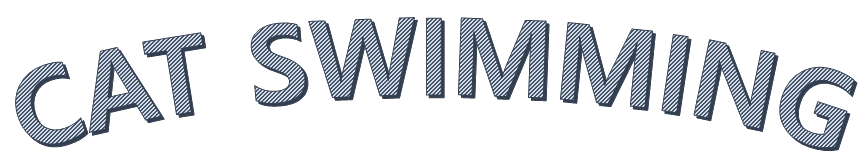
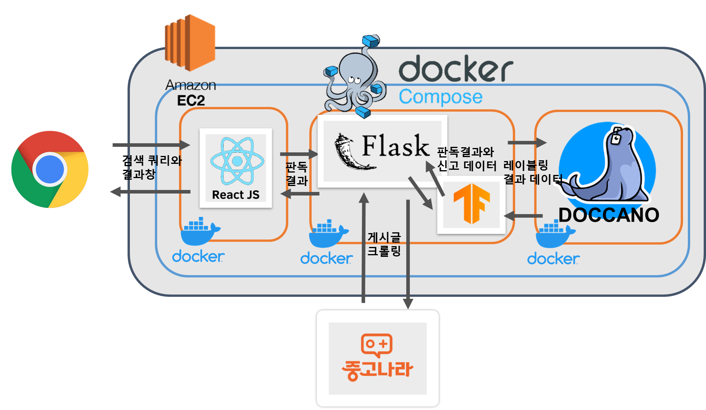
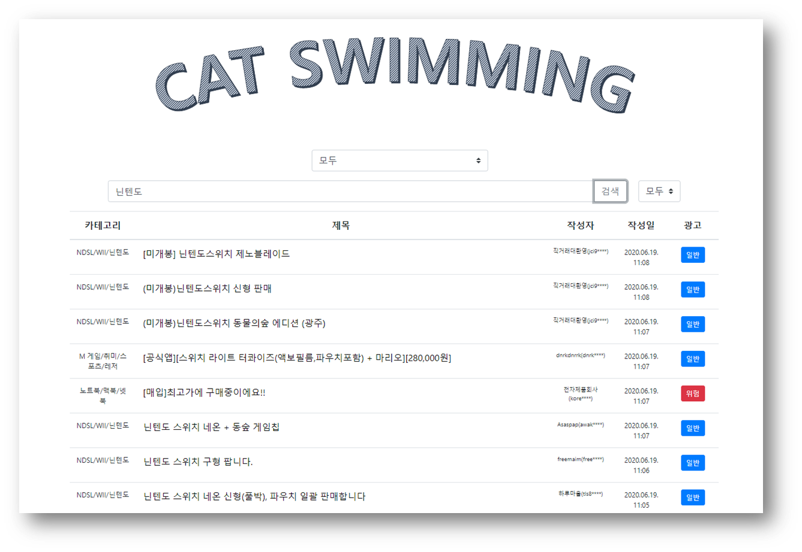
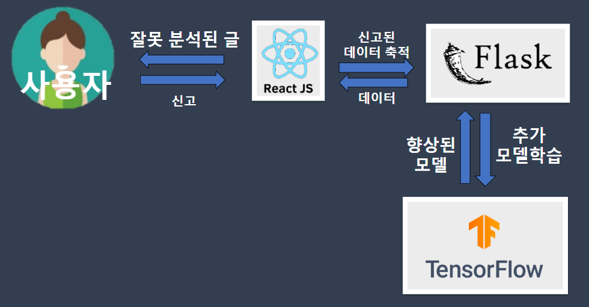

# CAT SWIMMING
머신러닝 기반 중고거래글 필터링 사이트



>원하는 물품을 키워드 검색을 통해 검색한 뒤, RNN 기반의 머신러닝 모델을 통하여 게시글이 광고, 업자일 확률을 표기해주는 검색엔진 페이지.

## 시연(Showcase)

<a class="badge-anchor" target="_blank" rel="noopener noreferrer" href="http://ec2-3-35-170-5.ap-northeast-2.compute.amazonaws.com/" ></a>  

- 오래된 ML 모델로 인해 필터링 성능(75%=>50%)이 극히 낮습니다. 나중에 재학습 예정


<a class="badge-anchor" target="_blank" rel="noopener noreferrer" href="https://docs.google.com/presentation/d/1KKJTHlEwaVJdzBErhU5smxjuStwCGHc0QLATmNejDM8/edit"></a>

- 서버 비용 관계로 일부 기간 동안에는 시연이 작동하지 않습니다.

## 데이터 레이블링 체험

<a class="badge-anchor" target="_blank" rel="noopener noreferrer" href="http://ec2-3-35-171-132.ap-northeast-2.compute.amazonaws.com:8000/"></a> 

- 데이터 레이블링 체험을 위한 체험자용 아이디
	- ID : visitor
	- PW : asdf123!
---	

1. 로그인 후, 프로젝트에 입장
---

2. 좌측 상단의 `Start Annotaion`을 눌러 시작, 자세한 설명은 중앙 상단의 `Guideline`을 참조해주세요 

---

## 기술 스택 및 구조(Tech stacks & Architecture)


### Tech Stacks
- **Javascript, Jira, Git, React, Flask, Tensorflow, Docker, AWS EC2, Doccano**

## 기능(features)

- **중고나라 게시판 별 게시글 키워드 검색 및 필터링**



- **잘못 필터링된 글 신고 및 신고 데이터를 토대로 일정 주기마다 모델 재학습**



## 팀(Team)
### REMEMBER US
2020년 3월 ~ 2020년 4월 개발
- 김기범
- 김승연
- 남선웅
- 윤준석
- 송광우

## 배포(Deployment)
### `docker-compose` 배포
```bash
// 슬레이브 노드 서버에서
cd [user-name]/Catswimming-Renewal/
docker-compose up -d
```

## License
@Team MEGATON™ All rights reserved.
